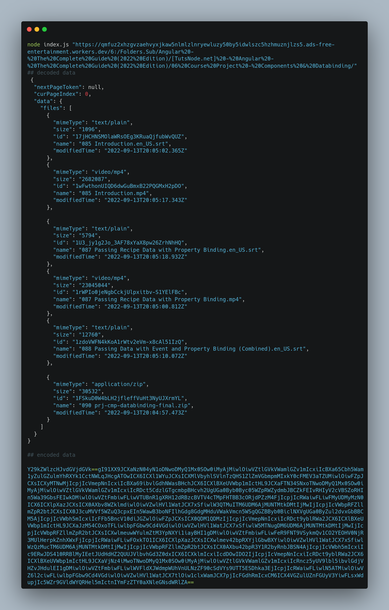

<div align="center">
<h1>Bhadoo Google Drive Index Response Decoder</h1>
</div>

-----

- A script to scrape and decode response from the Bhadoo Google Drive index.

- Learn more about the Bhadoo Google Personal/Shared Drive Index at: https://gitlab.com/ParveenBhadooOfficial/Google-Drive-Index

- The script also has the capability to scrape links that are protected by a username and password by providing the appropriate cookies.
 
----

<div align="center">
<h1>Screenshots</h1>
</div>




----

##### installation
```bash 
git clone https://github.com/mk1121/bhadoo-index-response-decoder.git
cd bhadoo-index-response-decoder
npm i
node index.js 'https://anime.anipirates.workers.dev/0:/'
```

##### .env file example

|     |     |
| --- | --- |
| COOKIE | AUTH0-AUTH=*****************      |
